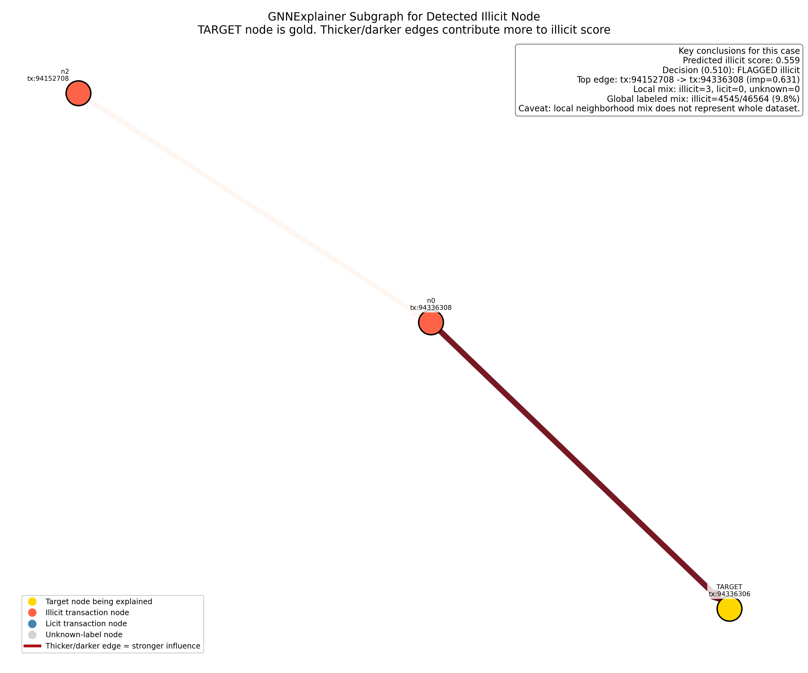
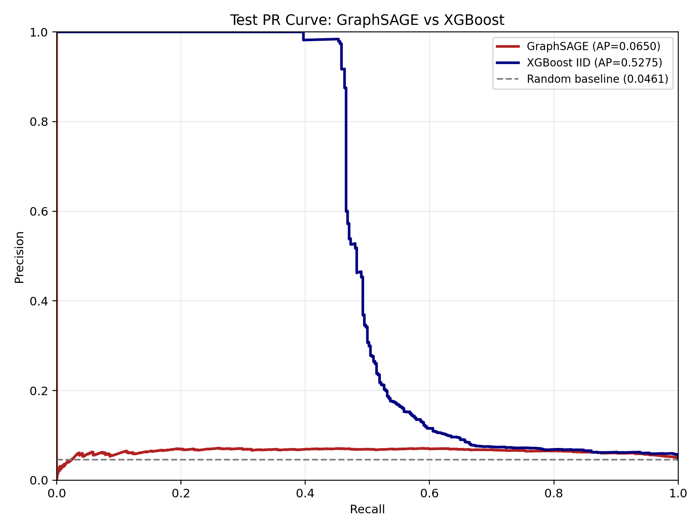
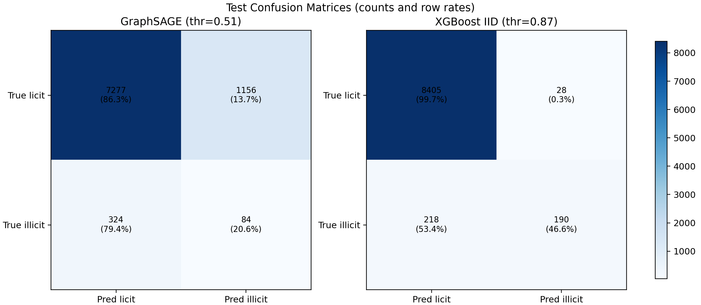
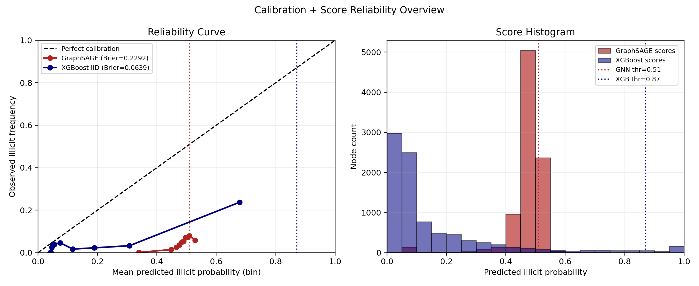
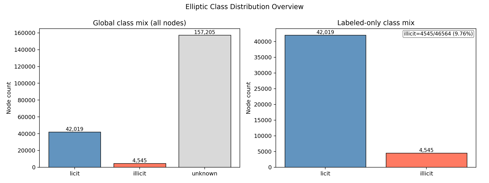
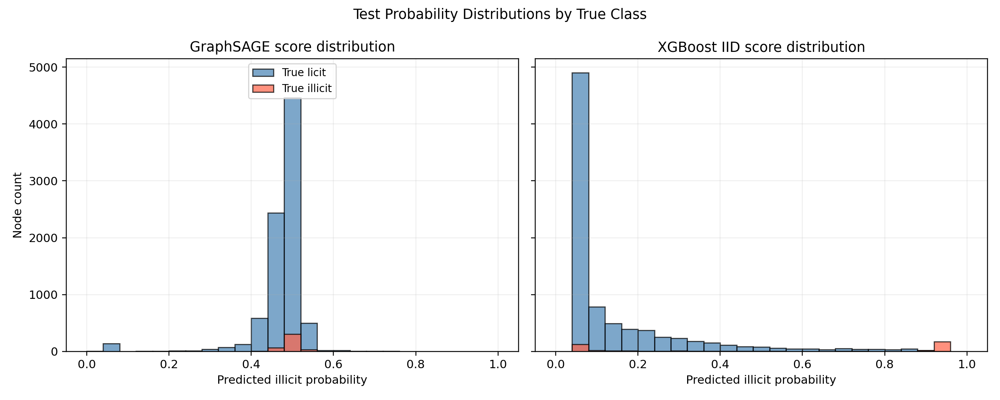
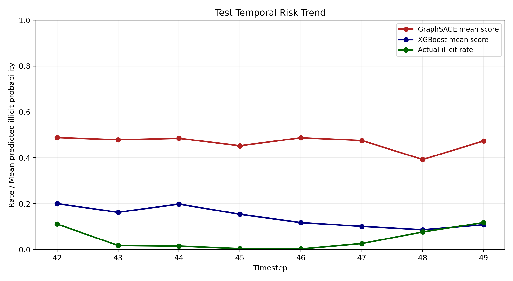
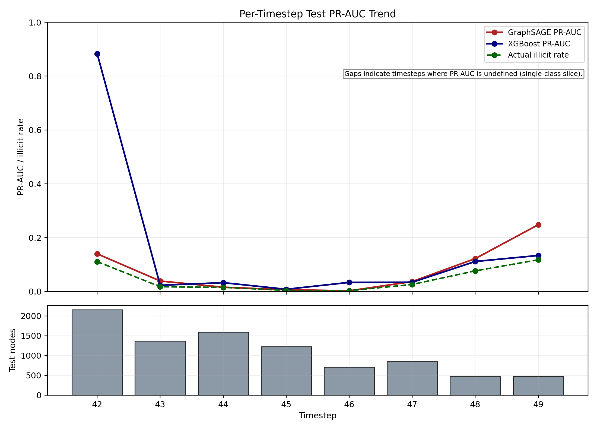

# Elliptic GNN Fraud Detection for Trust & Safety

<p align="center">
	
	
	
	
</p>

<table>
	<tr>
		<td><strong>Goal</strong><br/>Catch risky transaction patterns before they scale.</td>
		<td><strong>Approach</strong><br/>Graph model vs tabular baseline, same temporal split.</td>
		<td><strong>Output</strong><br/>Scores, benchmark table, and visual explanations.</td>
	</tr>
</table>

In this production-style portfolio project, I built a fraud detection workflow
for Bitcoin transaction graphs, including temporal evaluation, explainability,
and a fair IID baseline comparison.

I designed this repo to answer one practical question: does modeling transaction
relationships improve fraud detection over a strong tabular baseline? I train
both approaches on the same temporal split, compare PR-AUC and Macro-F1, and
ship explanation artifacts that analysts can actually review.

## Snapshot: Problem, Method, Metric, Business Impact

- Problem: Fraud signals in transaction networks are often coordinated, so
	row-by-row models can miss relationship-driven abuse patterns.
- Method: I built a temporal GraphSAGE pipeline and compared it against an IID
	XGBoost baseline on the same train/validation/test split.
- Metric: I evaluated both models with PR-AUC and Macro-F1 on imbalanced test
	data; best GraphSAGE reached PR-AUC 0.2283 and Macro-F1 0.6310, while
	XGBoost reached PR-AUC 0.5523 and Macro-F1 0.7980 in this setup.
- Business impact: The pipeline is production-style and investigation-ready;
	it delivers reproducible benchmarking, threshold-aware risk scoring, and
	explainability artifacts that help Trust and Safety teams prioritize review.

Quick meme energy (still true):
- "No temporal leakage? We are not time-traveling labels in this house."
- "GNN: let me cook on neighborhood context."
- "XGBoost on this split: still the final boss right now."

## Soft Overview | Non-Technical

If you are not technical, this project can be read as a fraud risk triage
system for Bitcoin transactions.

What I built in plain English:
- I take a large history of Bitcoin transactions.
- I teach a model what suspicious vs normal behavior looked like in the past.
- I score newer transactions by risk.
- I show why a transaction was flagged using a visual neighborhood graph.

What makes this different from simple fraud scoring:
- I do not only look at one transaction at a time.
- I also look at how transactions connect to each other.
- This helps surface coordinated fraud patterns that are hard to catch with
	traditional row-by-row models.

Who this is useful for:
- Trust and Safety teams prioritizing investigations.
- Fraud analysts deciding which cases to review first.
- Product and operations stakeholders who need transparent model outputs.

What decisions this supports:
- Which transactions should be investigated first.
- How aggressive or conservative risk thresholds should be.
- Whether graph-based modeling is outperforming a simpler tabular baseline.

What output you get:
- A risk score per transaction.
- A benchmark comparison between GraphSAGE and XGBoost.
- A visual explanation file plus a plain-language summary of the flagged case.

For an even simpler PM-facing writeup, see NON_TECH_EXPLANATION.md.

## Build Story

In this portfolio project, I compare graph-native modeling against traditional
IID tabular ML for coordinated fraud detection in Bitcoin transactions.

Problem setting I model:
- Nodes are Bitcoin transactions.
- Edges represent transaction flow relationships.
- Labels include illicit (fraud), licit, and unknown.

Why this matters:
- IID models treat each transaction independently and miss collusive behavior.
- My GNN pipeline leverages neighborhood structure to detect organized abuse rings.

Core deliverables I built:
1. Temporal graph training pipeline on the Elliptic dataset.
2. Fraud-focused evaluation (PR-AUC and Macro F1, not only accuracy).
3. Explainability artifact (GNNExplainer subgraph + weighted edges) for
	investigator-facing trust.

## Results Snapshot

What I achieved end-to-end:
- Built a production-style fraud detection pipeline with strict temporal
	train/validation/test splitting.
- Trained and evaluated both a GraphSAGE GNN model and an IID XGBoost baseline
	on the exact same split.
- Generated investigator-friendly explainability outputs for flagged cases:
	visual graph, plain-language summary, and ranked influential-edge CSV.

Measured results from benchmark sweep:
- Best GraphSAGE Test PR-AUC: 0.2283 (Run 3)
- Best GraphSAGE Test Macro-F1: 0.6310 (Run 2)
- XGBoost Test PR-AUC: 0.5523 (Runs 1 to 3)
- XGBoost Test Macro-F1: 0.7980 (Runs 1 to 3)

What I conclude today:
- The baseline currently outperforms my GNN on measured PR-AUC and Macro-F1.
- The project is complete as a rigorous comparison framework.
- My next step is targeted GNN improvement before claiming graph superiority.

### Current Conclusion (Transparent Status, Apr 2026)

- This repository is complete as an end-to-end, reproducible fraud-ML benchmark.
- On the current temporal split and settings, XGBoost is the stronger model.
- GraphSAGE remains useful in this project for graph-native explainability and as
	a structured baseline for future GNN improvements.

## Data Source Trail

I downloaded the CSV files in this workspace through PyTorch Geometric's
built-in `EllipticBitcoinDataset` loader, which pulls files from the PyG
dataset host.

Source links used by the loader:
- https://data.pyg.org/datasets/elliptic/elliptic_txs_features.csv.zip
- https://data.pyg.org/datasets/elliptic/elliptic_txs_edgelist.csv.zip
- https://data.pyg.org/datasets/elliptic/elliptic_txs_classes.csv.zip

Official PyG dataset documentation:
- https://pytorch-geometric.readthedocs.io/en/latest/generated/torch_geometric.datasets.EllipticBitcoinDataset.html

Note:
- The dataset host root index https://data.pyg.org/datasets/elliptic/ returns
	Access Denied (403).
- Use the direct ZIP links listed above to download the CSVs.

Local location where I stored the files after download:
- `data/raw/elliptic_txs_features.csv`
- `data/raw/elliptic_txs_edgelist.csv`
- `data/raw/elliptic_txs_classes.csv`

## Setup

```bash
pip install -r requirements.txt
```

Environment note:
- `requirements.txt` pins the package versions used in this workspace run.

## Run Modes

Run my end-to-end pipeline:

```bash
python elliptic_gnn_fraud_detection.py --data-dir data/raw --output-dir outputs
```

Optional faster local test run:

```bash
python elliptic_gnn_fraud_detection.py --data-dir data/raw --output-dir outputs --epochs 3 --hidden-dim 64 --num-layers 2 --explainer-epochs 20
```

Adaptive explanation mode (tries to include licit context in the explanation neighborhood):

```bash
python elliptic_gnn_fraud_detection.py --data-dir data/raw --output-dir outputs --adaptive-explain-hops --max-explain-hops 12 --min-licit-nodes 1
```

Benchmark mode (skip explainability for faster model sweeps):

```bash
python elliptic_gnn_fraud_detection.py --data-dir data/raw --output-dir outputs --skip-explainability
```

Log verbosity options:

```bash
# Warnings/errors only
python elliptic_gnn_fraud_detection.py --data-dir data/raw --output-dir outputs --quiet

# More detailed training logs
python elliptic_gnn_fraud_detection.py --data-dir data/raw --output-dir outputs --verbose
```

## Quick Verification

Use this command for a fast end-to-end smoke check:

```bash
python elliptic_gnn_fraud_detection.py --data-dir data/raw --output-dir outputs --epochs 3 --hidden-dim 64 --num-layers 2 --explainer-epochs 20
```

Expected terminal markers:
- `[gnn val] ...`
- `[gnn test] ...`
- `[xgb val] ...`
- `[xgb test] ...`
- `[compare] test metrics (same split)`
- `[done] run complete`

Expected artifact refresh in `outputs/`:
- `test_pr_curve_comparison.png`
- `test_confusion_matrix_comparison.png`
- `test_calibration_comparison.png`
- `gnnexplainer_tp_subgraph.png`

## Pipeline Walkthrough

1. I load node features, edges, and labels into a PyG `Data` object.
2. I create temporal train/validation/test splits by timestep.
3. I handle severe class imbalance using weighted BCE loss.
4. I train a multi-layer GraphSAGE model with BatchNorm, dropout, and residuals.
5. I tune the decision threshold on validation Macro F1.
6. I train an IID XGBoost baseline on node features using the same temporal split.
7. I report PR-AUC, Macro F1, precision, and recall for both models.
8. I print a side-by-side GNN vs. XGBoost test comparison table.
9. I run GNNExplainer on a detected true-positive illicit node.
10. I plot an explanation subgraph with edge importance weights.

## Output Files

Main explainability outputs I generate:
- `outputs/gnnexplainer_tp_subgraph.png`
- `outputs/gnnexplainer_tp_summary.md`
- `outputs/gnnexplainer_top_edges.csv`

Additional result visualization PNGs:
- `outputs/class_mix_overview.png`
- `outputs/test_pr_curve_comparison.png`
- `outputs/test_confusion_matrix_comparison.png`
- `outputs/test_score_distribution_comparison.png`
- `outputs/test_temporal_risk_trend.png`
- `outputs/test_calibration_comparison.png`
- `outputs/test_timestep_pr_auc_trend.png`

## Visual Gallery

### Explainability



### Model Comparison





### Distribution and Temporal Views






How to interpret these outputs:
- In the PNG, the gold node is the flagged transaction being explained.
- Red nodes are known illicit, blue nodes are known licit, and gray nodes are
	unknown labels.
- Thicker/darker edges indicate stronger influence on the model decision.
- The markdown summary explains the case in plain language.
- The CSV gives a ranked list of influential edges for easy review in tools.

How to read the new result PNGs:
- `class_mix_overview.png`: Global class balance (including unknown labels) and labeled-only class split.
- `test_pr_curve_comparison.png`: PR curves and AP values for GraphSAGE vs XGBoost on the same test split.
- `test_confusion_matrix_comparison.png`: Side-by-side confusion matrices at each model's tuned threshold.
- `test_score_distribution_comparison.png`: Probability histograms by true class for both models.
- `test_temporal_risk_trend.png`: Timestep-level trend of mean model risk scores vs actual illicit rate.
- `test_calibration_comparison.png`: Reliability curves and score histograms to assess calibration quality.
- `test_timestep_pr_auc_trend.png`: Per-timestep PR-AUC trend for GraphSAGE and XGBoost, plus timestep sample volume.

Recent visualization polish:
- `gnnexplainer_tp_subgraph.png`: moved the key-conclusions callout lower and increased its text size to keep the title readable.
- `gnnexplainer_tp_subgraph.png`: left-most node label is now forced to the left side for better readability.
- `class_mix_overview.png`: shifted the labeled-mix annotation to the right so it does not overlap the licit bar.
- `test_calibration_comparison.png`: moved score-histogram legend to the right side to avoid covering bars.
- `test_timestep_pr_auc_trend.png`: moved the "PR-AUC undefined" note to the top-right area below the legend.

Important context for reviewers:
- The global dataset is not illicit-dominant (illicit is a minority).
- Some explanation plots can still look mostly red because they are local views
	around one suspicious target node, and that local neighborhood can be
	illicit-heavy or contain no nearby licit nodes.
- Always interpret local explanation composition together with global class
	distribution.

## Temporal Integrity

To better mimic production deployment, I use this setup:
- Train graph uses only nodes and edges at or before the train cutoff.
- Validation graph uses only nodes and edges at or before the val cutoff.
- Test graph uses the full graph.

This is stricter and more realistic than random IID splits.

## Benchmark Sweep | Same Temporal Split

I executed the following runs in this workspace using the same temporal
train/validation/test split for both models.

| Run | GraphSAGE config | GraphSAGE Test PR-AUC | GraphSAGE Test Macro-F1 | XGBoost Test PR-AUC | XGBoost Test Macro-F1 |
|---|---|---:|---:|---:|---:|
| 1 | epochs=10, hidden=128, layers=3, dropout=0.30, lr=1e-3 | 0.1953 | 0.6159 | 0.5523 | 0.7980 |
| 2 | epochs=20, hidden=128, layers=3, dropout=0.30, lr=1e-3 | 0.2173 | 0.6310 | 0.5523 | 0.7980 |
| 3 | epochs=15, hidden=192, layers=3, dropout=0.25, lr=8e-4 | 0.2283 | 0.6164 | 0.5523 | 0.7980 |

My current conclusion from measured runs:
- The IID XGBoost baseline is currently outperforming GraphSAGE on both PR-AUC
	and Macro-F1 under these settings.
- This repository now supports fair, reproducible side-by-side benchmarking;
	additional GNN tuning is required before claiming GNN outperformance.

Benchmark logs:
- `outputs/benchmark_run1.log`
- `outputs/benchmark_run2.log`
- `outputs/benchmark_run3.log`

## Why This Feels Different

Compared with typical portfolio ML projects, I emphasize:
- Temporal realism over random IID splitting, reducing data leakage risk.
- Fair model comparison: GNN and tabular baseline share the same split and
	fraud-focused metrics.
- Trust and Safety alignment: optimization and reporting center on PR-AUC,
	Macro-F1, and operationally meaningful threshold tuning.
- Investigation-ready explainability outputs, not just a raw prediction score.
- Dual-audience communication: technical implementation plus non-technical
	narrative for PM, operations, and stakeholder review.

## References + Papers

1. Weber, M., Domeniconi, G., Chen, J., Weidele, D. K. I., Bellei, C.,
	Robinson, T., and Leiserson, C. E. (2019). Anti-Money Laundering in
	Bitcoin: Experimenting with Graph Convolutional Networks for Financial
	Forensics. https://arxiv.org/abs/1908.02591

2. Elliptic Bitcoin Transaction Dataset (PyTorch Geometric distribution).
	https://pytorch-geometric.readthedocs.io/en/latest/generated/torch_geometric.datasets.EllipticBitcoinDataset.html

3. Hamilton, W., Ying, Z., and Leskovec, J. (2017). Inductive Representation
	Learning on Large Graphs (GraphSAGE). https://arxiv.org/abs/1706.02216

4. Velickovic, P., Cucurull, G., Casanova, A., Romero, A., Lio, P., and
	Bengio, Y. (2018). Graph Attention Networks (GAT) (background / future
	architecture extension).
	https://arxiv.org/abs/1710.10903

5. Ying, R., Bourgeois, D., You, J., Zitnik, M., and Leskovec, J. (2019).
	GNNExplainer: Generating Explanations for Graph Neural Networks.
	https://arxiv.org/abs/1903.03894

6. Fey, M., and Lenssen, J. E. (2019). Fast Graph Representation Learning with
	PyTorch Geometric. https://arxiv.org/abs/1903.02428

7. Paszke, A., Gross, S., Massa, F., et al. (2019). PyTorch: An Imperative
	Style, High-Performance Deep Learning Library.
	https://arxiv.org/abs/1912.01703

8. Saito, T., and Rehmsmeier, M. (2015). The Precision-Recall Plot Is More
	Informative than the ROC Plot When Evaluating Binary Classifiers on
	Imbalanced Datasets. https://doi.org/10.1371/journal.pone.0118432

9. Sokolova, M., and Lapalme, G. (2009). A systematic analysis of performance
	measures for classification tasks.
	https://doi.org/10.1016/j.ipm.2009.03.002

10. Chen, T., and Guestrin, C. (2016). XGBoost: A Scalable Tree Boosting
	System. Proceedings of the 22nd ACM SIGKDD International Conference on
	Knowledge Discovery and Data Mining.
	https://doi.org/10.1145/2939672.2939785
